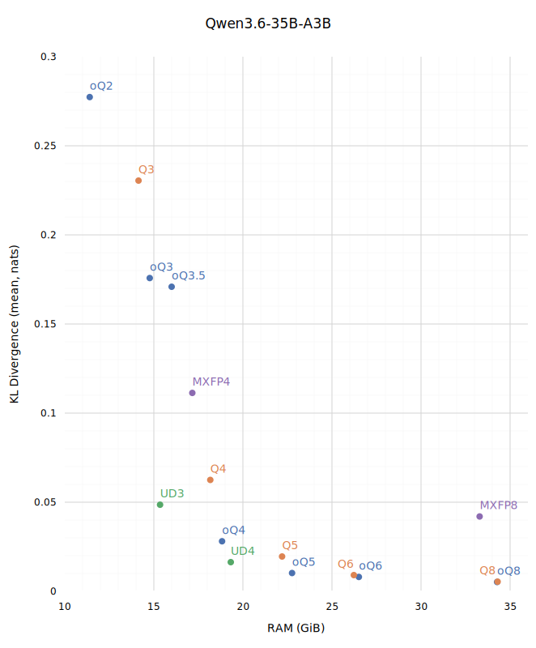

# MLX KLD

Set of scripts to measure KLD, made specifically for MLX format.

## Kullback-Leibler (KL) Divergence

>KLD measures the "distance" between two probability distributions. It doesn't just look at one token; it compares the entire vector of probabilities from the original model to the quantized model. It asks, "How much information is lost when we use the quantized distribution to approximate the original one?"

Read ["Why Maybe We're Measuring LLM Compression Wrong"](https://huggingface.co/blog/rishiraj/kld-guided-quantization) and ["oQ: oMLX Universal Dynamic Quantization"](https://github.com/jundot/omlx/blob/main/docs/oQ_Quantization.md) for details.



See [results](./results).

## Usage

```sh
# clone the repo
git clone git@github.com:deepsweet/mlx-kld.git
cd mlx-kld/

# install dependencies
uv sync

# download an original reference model
uv tool install huggingface-hub
hf download Qwen/Qwen3.6-35B-A3B

# convert it into MLX
# add `--dtype float16` if needed
uv run mlx_lm.convert \
  --hf-path ~/.cache/huggingface/models/Qwen/Qwen3.6-35B-A3B \
  --mlx-path /path/to/Qwen3.6-35B-A3B-MLX

# prepare a diverse prompt, Aes Sedai's "combined_all_micro" would suffice
curl -L "https://huggingface.co/AesSedai/GLM-4.5-GGUF/raw/main/combined_all_micro.txt" > prompt.txt

# load, calculate and save reference model log-probabilities
# reference.py <reference_model_path> <max_tokens>
uv run mlx_kld.reference /path/to/Qwen3.6-35B-A3B-MLX 16384

# compare a target quantized model against it
# compare_target.py <target_model_path>
uv run mlx_kld.compare /path/to/Qwen3.6-35B-A3B-MLX-oQ8

# cleanup when finished
rm prompt.npy reference.npy
```

## Generate chart

```sh
uv run results/Qwen3.6-35B-A3B.py
```

## Lint

```sh
uv sync --group dev
uv run ruff check .
```
